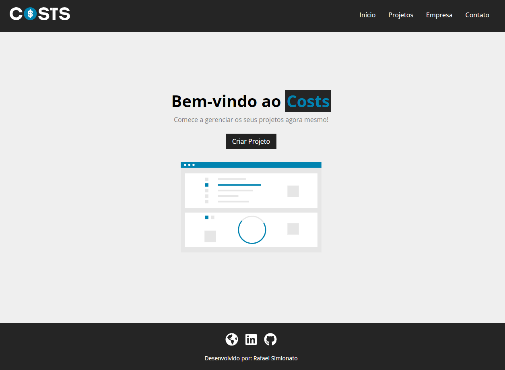
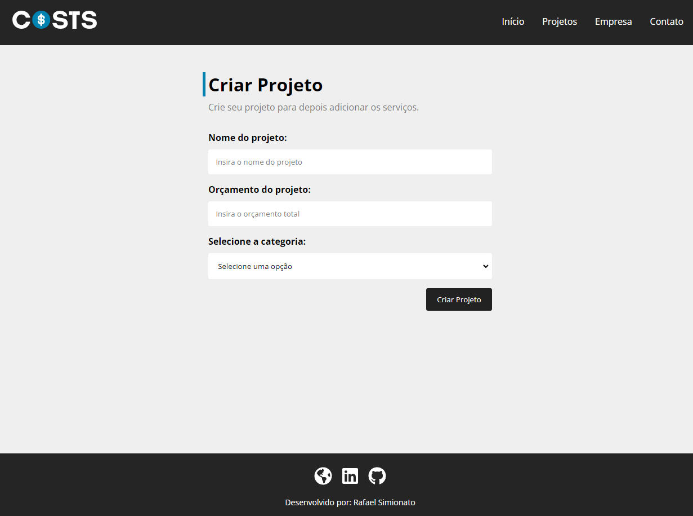

<p align='center'></p>
<h1 align='center'>Costs</h1>
<p align='center'>


</p>

# 🔖 Descrição
<p> 🪙 Criação de um projeto CRUD desenvolvido no curso de ReactJS do canal <a href="https://www.youtube.com/watch?v=FXqX7oof0I4" target="_new">Hora de Codar</a>.<p>

# 🛠️ Funcionalidades
- Cadastro e exclusão de projetos;

# 🚀 Tecnologias
Esse projeto está utilizando as seguintes tecnologias:
- HTML
- CSS
- JavaScript
- [ReactJS](https://create-react-app.dev/)
- [JSON Server](https://github.com/typicode/json-server)


# 🎲 Como utilizar

## Clone esse repositório
```sh
git clone https://github.com/rafaasimi/costs-reactjs.git
```


## Navegue até o repositório do projeto
```sh
cd costs-reactjs
```


## Instale as dependências
```sh
yarn install
```

## Inicie o projeto
```sh
yarn start
```

## Inicie o servidor
```sh
yarn server
```

<h3>🖼 Layout</h3>



## 📝 Licença
<p>O projeto se encontra sob licença MIT. Para mais detalhes, acesse <a href='LICENSE'>license<a>.</p>

---
<p>Criado com 💙 por <a href='https://github.com/rafaasimi/' target='_blank'>Rafael Simionato</a></p>
